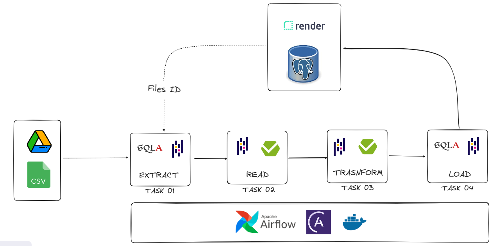

# Orchestrating an ETL with Airflow - From Google Drive to PostgreSQL

This project aims to orchestrate an ETL (Extract-Transform-Load) with Airflow, extracting CSV files from a folder in Google Drive, transforming values, and storing them in a PostgreSQL database.

The data is handled in a pandas DataFrame format, and all the data validation is performed using the [Pandera](https://pandera.readthedocs.io/en/stable/#) library, a Pydantic-based library to validate DataFrame schemas. By setting a specific data contract, validations occur in two phases: when extracted and when transformed.

The Airflow implementation was created using the Astro CLI, the command line interface for data orchestration from [Astronomer](https://docs.astronomer.io/).

This project also has a CI for every Pull Request made using GitHub Actions, where the schema contract is tested with the pytest library.



## Table of Contents

- [Context](#context)
  - [Contract Schema](#contract-schema)
- [How it works](#how-it-works)
  - [Project Folder Structure](#project-folder-structure)
- [How to run this project](#how-to-run-this-project)
  - [Run without Airflow](#run-without-airflow)
- [Further Tasks](#further-tasks)


## Context

This project was built in a context where a folder inside Google Drive regularly receives different CSV files containing the operational revenue from various companies in three types of currencies: USD, EUR, and YEN. This data must be stored in a PostgreSQL database with the operational revenue converted to USD and the currency conversion rate, taking the last quotation of the month date that is in the CSV.

### Contract Schema

The project uses the following contract schema to validate the data:

* Schema-in: Used when extracting files from Google Drive in Task 02

| Column               | Type                        | Constraints                                    |
|----------------------|-----------------------------|------------------------------------------------|
| company              | Series[str]                 |                                                |
| currency             | Series[str]                 | in ['EUR', 'USD', 'YEN'], all values equal                     |
| operational_revenue  | Series[float]               | greater than or equal to 0                    |
| date                 | Series[DateTime]         | all values equal                                               |
| file_id              | Optional[str]               |                                                |

* Schema-out: Used when transforming data in Task 03

| Column            | Type                | Constraints                     |
|-------------------|---------------------|---------------------------------|
| company           | Series[str]         |                                 |
| currency          | Series[str]         | in ['EUR', 'USD', 'YEN'], all values equal      |
| operational_revenue | Series[float]    | greater than or equal to 0     |
| date              | Series[DateTime] | all values equal                             |
| file_id           | Series[str]         |                                 |
| convertion_rate   | Series[float]       | greater than or equal to 0     |
| usd_converted     | Series[float]       | greater than or equal to 0     |

## How it works

**<u>Task 01:</u> Connect with Google Drive API and extract CSV files**

In this initial task, the script connects to the Google Drive API by passing our credentials in JSON file format and specifying the parent folder name and the folder from which we want to extract the CSV files. Subsequently, it retrieves all file information from the designated folder, including file name, Google Drive file ID, and file type.

Google Drive assigns a unique ID to each file uploaded to its folders, which is inserted into the database as a unique file identifier. This allows for filtering to determine if the file has already been uploaded to the database in subsequent Airflow triggers.

To facilitate this task, a GoogleDrive class was created to encapsulate all desired functionalities of the Google Drive API in `google_drive.py`. 

The task output is a list of DataFrames, where each DataFrame represents a CSV file extracted from the Google Drive folder.

**<u>Task 02:</u> Validate extracted data**

Receives the list of DataFrames extracted from Task 01 and validates it according to the contract schema using the Pandera library, raising an invalid schema error if applicable.

The output is a list of validated DataFrames.

**<u>Task 03:</u> Transform data and validate it**

Receives a list of DataFrames and performs the transformations. It maps both the currency and the date from each DataFrame and includes the currency rate conversion and the USD amount converted columns using the rate conversion from that date. It also performs schema validation after this transformation using Pandera.

The conversion rate data is obtained from the FRED `pandas_datareader` library, from the links below:

* [U.S. Dollars to Euro Spot Exchange Rate](https://fred.stlouisfed.org/series/DEXUSEU)
* [Japanese Yen to U.S. Dollar Spot Exchange Rate](https://fred.stlouisfed.org/series/DEXJPUS)

The output is a list of transformed and validated DataFrames.

**<u>Task 04:</u> Load data in database**

This final task loads the data into a PostgreSQL database. 

### Project Folder Structure

```
.
├── Dockerfile
├── README.md
├── airflow_settings.yaml
├── dags
│   └── dag_etl.py
├── data
│   ├── eur_revenue.csv
│   ├── usd_revenue.csv
│   ├── wrong_data.csv
│   └── yen_revenue.csv
├── dev-requirements.txt
├── docker-compose.yml
├── packages.txt
├── pics
│   └── etl-diagram.png
├── pyproject.toml
├── requirements.txt
├── src
│   ├── __init__.py
│   ├── database.py
│   ├── etl.py
│   ├── google_drive.py
│   ├── main.py
│   ├── schema.py
│   └── transform_utils.py
└── tests
    ├── dags
    ├── test_schema_in.py
    └── test_schema_out.py
```


## How to run this project

All the steps here were intended to a `bash` terminal.

Google Drive API requires a JSON file to authenticate the connection, and although it's not correct, in this project it was uploaded in the root directory, where the file `dags/dag_etl.py` will search for the file. So, to run as it is, you need to upload the JSON file in the root directory with the name `service_account.json`.  Make sure that this file is included in `.gitignore`. Here are some resources on how to do it: [How to Upload Files Using the Google Drive API in Python](https://ragug.medium.com/how-to-upload-files-using-the-google-drive-api-in-python-ebefdfd63eab), [Using Google Drive API with Python and a Service Account](https://medium.com/@matheodaly/using-google-drive-api-with-python-and-a-service-account-d6ae1f6456c2), and a [video tutorial](https://www.youtube.com/watch?v=tamT_iGoZDQ).


The name of the parent folder in Google Drive is set to be `python_to_drive` and the folder from where it will extract the CSV files must be called `Operational Revenue`. You can change the names by just changing the variables `parent_folder_name` and `folder_to_extract_from` in [`dags/dag_etl.py`](dags/dag_etl.py).

You also need to connect the app to your own PostgreSQL database. You can do this by following the steps below:

1.1 - Clone the repository locally:
```bash
git https://github.com/lealre/etl-airflow.git
```

1.2 - Access the project folder:
```bash
cd etl-airflow
```

1.3 - Here we have two options to connect to PostgreSQL: locally with Docker (1.3.1) or to connect to an existing database using credentials passed in the `.env` file (1.3.2). By default, if there are no credentials provided, the program will attempt to automatically connect to Docker locally, using the credentials specified in [docker-compose.yml](docker-compose.yml).  
    
1.3.1 - Locally using Docker

Create the database and PGAdmin container with Docker:
```bash
docker compose up -d
```

To access the database:

I. Go to the localhost link in your browser: [http://localhost:8888/](http://localhost:8888/)

II. Access PGAdmin with the credentials specified in the docker-compose.yaml file:
   - Username: `user-name@domain-name.com`
   - Password: `pgadmin`

III. Set the master password (when accessing for the first time).

IV. Right-click on the server to connect PGAdmin to the database.

V. Connect to the database using the credentials defined in the `docker-compose.yaml` file:
   - Host name: `db`
   - Password: `postgres`


**OR**
    
1.3.2 - Connecting with an existing database 

Create the `.env` file in the root folder, passing the respective keys from your own PostgresSQL Database:
```bash
echo "POSTGRES_USER=<your-database-keys>" >> .env
echo "POSTGRES_PASSWORD=<your-database-keys>" >> .env
echo "POSTGRES_HOST=<your-database-keys>" >> .env
echo "POSTGRES_PORT=<your-database-keys>" >> .env
echo "POSTGRES_DB=<your-database-keys>" >> .env
```

Make sure `.env` file is included in `.gitignore`.

From here, we use the Astro CLI to run Airflow with Docker.

1.4 - Install Astro CLI:
```bash
curl -sSL install.astronomer.io | sudo bash -s
```

1.5 - Run Airflow with Docker
```bash
astro dev start
```

NOTES: 
* Using the flag `--Wait=5m` to wait 5 minutes for the webserver to get healthy before timing out. The default is 1 minute for most machines.
* `astro dev kill` force-stop and remove all running containers for your local Airflow environment.

After these steps, it will automatically open the localhost link with the Airflow UI. The username and password to access are both `admin`.

### Run without Airflow

You also can run this project without Airflow. To do it, you should follow all the steps until 1.3, and then do the following:

2.1 - Install Python version 3.11.5:
```bash
pyenv install 3.11.5
```

2.2 - Set the local version of Python to 3.11.5:
```bash
pyenv local 3.11.5
```

2.3 - Create a virtual enviroment and activate it:
```bash
python -m venv .venv
source .venv/bin/activate
```

2.4 - Install all dependencies from the project:
```bash
pip install -r dev-requirements.txt
```

2.5 - Run the project:
```bash
task main
```

2.6 -  (Optional) Run the schema test:
```bash
task test_schema_in # test schema in
task test_schema_out # test schema out
```

## Further Tasks

These are some areas where this project can improve:

* The JSON file to connect with the Google Drive API should be passed in another way.
* As we are interested only in the year and month, it can improve in validating the date in the schema-in, restricting the date to the YYYY-MM format.
* When a file that doesn't match the schema is found, the script could move it from the folder where it is extracting the files to a new folder, designated for files in the same situation. This would make it easier to separate the correct files from the incorrect schema files.
* The project can be extended to support more types of files than just CSV, such as PARQUET and XLSX files.
* There are more tests to perform with pytest, including integration tests.