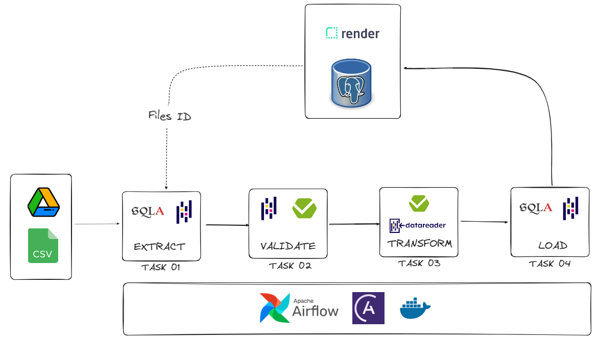

# Orchestrating an ETL with Airflow - From Google Drive to PostgreSQL

This project aims to orchestrate an ETL (Extract-Transform-Load) with Airflow, extracting CSV files from a folder in Google Drive, transforming values and storing in a PostgueSQL database.

In all ETL process the data is handled in a pandas DataFrame format, and all the data validation is perfored using Pandera library, a Pydantic based library to validate DataFrames schemas. By setting a specific data contract, validations occurs in two phases: when extracted and when transformed.

As Google Drive gives a specific and unique id to each files that is uploded to its folders, i inserted this same id in database as a unique identifier, with the proupose of filter if the files was already uploaded in database or not in the next airflow trigger.

## How it works



There are 4 tasks in airflow dag, that are:

**Task 01: Connect with Google Drive API and Extract files information**
In this first task it connects with Google Drive API, by passing our credentials as a JSON file format, and pass a parameter the parent folder name and the folder from where we want to extract the CSV files. Then it takes all the files informations from the folder we want to extract the it (file name, Google Drive file ID, type of file) and compare with all the files ID already stored in database to avoid replicated files. 

To this task a GoogleDrive class was created to abstract all functionalities i wanted from GooGle Drive API in `google_drive.py`.

It returns a list of DataFrames, were each DataFrame is a CSV file from Google Drive.

**Task 02: Extract data from CSV files and validate it**
This task receives a list of DataFrames and validates it acording to the contract schema by using Pandera library.

It returns a list of DataFrames validated

**Task 03: Transform data and validate it**
This tasks receives list of DataFrames and perform the transformations. It maps both the currency and the date from each DataFrame and includes the currency rate convertion and the USD amount converted columns. It also perfomrs a schema validation after this transformation usgin Pandera.

It returns a list of DataFrames transformed and validated as contract schema.


**Task 04: Load data in database**
This final task loads the data in a PostgreSQL database. 


### The data

### Project Folder Structure

```
├── Dockerfile
├── README.md
├── airflow_settings.yaml
├── dags
│   └── dag_etl.py
├── packages.txt
├── pyproject.toml
├── pytest.ini
├── requirements.txt
├── src
│   ├── __init__.py
│   ├── database.py
│   ├── etl.py
│   ├── google_drive.py
│   ├── main.py
│   ├── schema.py
│   └── transform_utils.py
└── tests
    ├── dags
    │   └── test_dag_example.py
    ├── test_schema_in.py
    └── test_schema_out.py
```


## How to run this project

